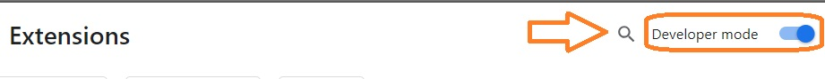
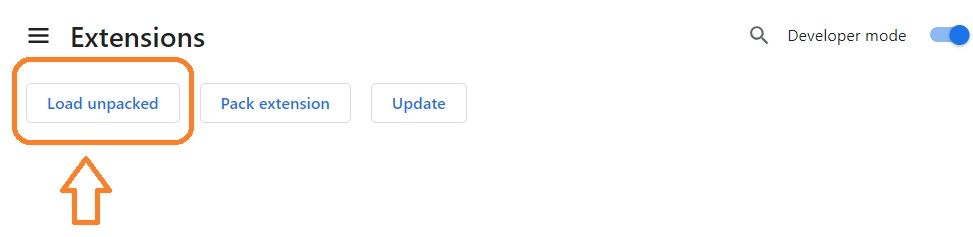
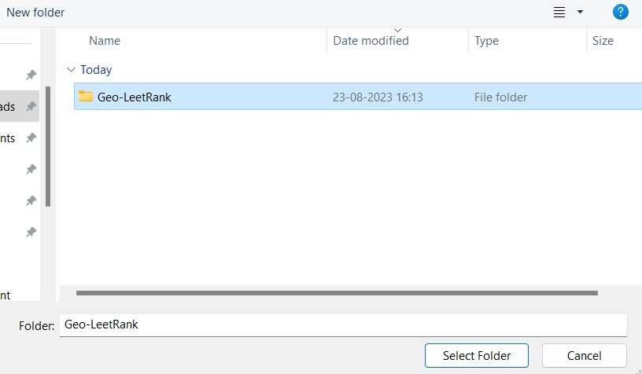
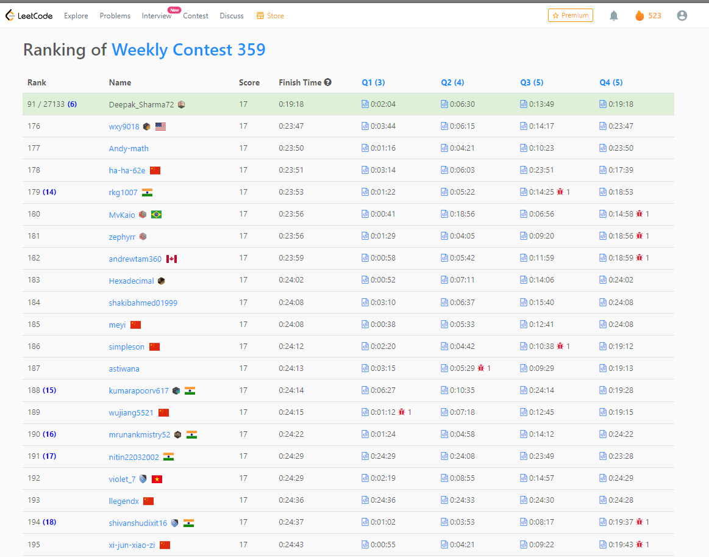

## Geo-LeetRank: Simplifying LeetCode Contest Country Rankings

### What is Geo-LeetRank?
"Geo-LeetRank" is a Chrome extension designed to provide you with a clear and instant view of your country's ranking within LeetCode coding contests. When you participate in a contest, your global rank indicates your standing among all participants. With "Geo-LeetRank," you can discover where you stand specifically within your own country.
_For instance, if your global rank is 800 and 200 of those participants are from your country, your country ranking will be displayed as 200._

### How to Setup and Use Geo-LeetRank
#### **Follow the following steps to setup and use ourextension.**
1. Clone this repository to your local machine.
    ```
    ```
2. Copy and paste the following URL into your Chrome browser's search bar.
    ```
    chrome://extensions
    ```
3. Enable developer mode by toggling the switch.
    
4. Click on the "Load unpacked" button.
    
5. Browse and select the cloned repository from your system.
    
6. You're all set to go! Geo-LeetRank is now active and ready to use.
    


### Contribution to this extension to make it even more better are welcomed and highly appreciated.


